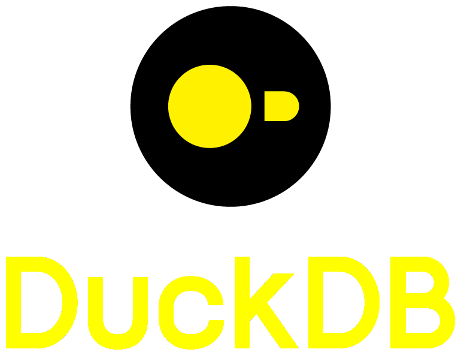

<!-- Hi, I’m Renan 👋 -->

I am a data engineering and business intelligence professional with a strong background in Accounting & Finance. My passion lies in leveraging data to create solutions that drive financial growth sustainable competitive advantage for businesses.

If you'd like to connect, please reach out to me on LinkedIn or via email.

### Programming Languages

### Cloud Platforms

### IDEs

### DevOps

### Databases

### Structured Tables

### Webdev

 

 

